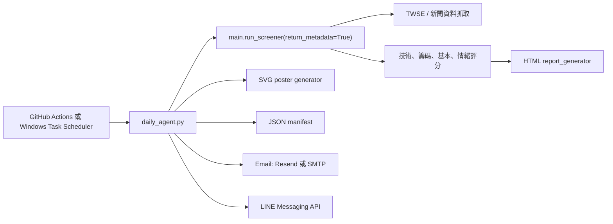

# 台股晨間分析 Agent 計畫

最後更新：2026-05-24

## 目標

建立一個週一到週五早上自動執行的分析 agent，整理台股掃描結果、推薦觀察名單、產出易讀報告與視覺海報，並透過 Email 或 LINE 送達。

此系統定位為「研究與紀錄工具」，不是下單系統，也不輸出保證獲利語氣。

## 預期產物

- HTML 完整報告：保留所有候選股、分數拆解、重點訊號與免責聲明。
- SVG 視覺海報：適合手機閱讀，列出 Top 5、總分、技術/籌碼/基本/情緒分數。
- JSON 執行紀錄：保存每次執行時間、掃描檔數、候選檔數、通知結果與產出檔案位置。
- 通知摘要：Email 內嵌 HTML 表格，LINE 推送簡短文字摘要。

## 執行架構



## 報告內容規格

每日報告包含：

- 今日市場狀態：市場情緒、分數調整倍率、產生時間。
- 掃描摘要：掃描檔數、初篩候選檔數、符合門檻檔數、最低分數門檻。
- Top picks：股票代號、名稱、價格、總分、分級。
- 分數拆解：技術面、籌碼面、基本面、情緒面。
- 推薦理由：每檔列出 1-4 個主要訊號。
- 風險提醒：自動化分析免責聲明，提醒仍需人工確認量能、消息與大盤風險。

## 隱私與上傳原則

以下內容不得 commit 或上傳到 GitHub：

- `.env`、`.env.local`、任何 `.env.*` 私密設定檔。
- API key、LINE channel access token、Email/SMTP 密碼、Resend key。
- 每日產出的 `reports/` 報告、JSON manifest、海報檔。
- 含有個人信箱、LINE user id、投資紀錄或自選股隱私內容的檔案。

已採取措施：

- `.gitignore` 排除 `.env*`、`reports/`、金鑰檔、venv 與快取。
- `.env.example` 只放 placeholder，不放任何真實值。
- `scripts/secret_scan.py` 會在完整性檢查中掃描疑似金鑰。
- GitHub Actions 不上傳 artifact，報告只在執行環境內產生並透過你設定的通知管道送出。

## 通知策略

### Email

優先採用 Resend，原因是 Python/REST API 簡單、適合自動化報告，也支援附件。若不想使用第三方郵件 API，也可以切換成 SMTP。

必要環境變數：

- `AGENT_SEND_EMAIL=true`
- `EMAIL_PROVIDER=resend`
- `EMAIL_FROM`
- `EMAIL_TO`
- `RESEND_API_KEY`

SMTP fallback：

- `EMAIL_PROVIDER=smtp`
- `SMTP_HOST`
- `SMTP_PORT`
- `SMTP_USER`
- `SMTP_PASSWORD`

### LINE

不要使用 LINE Notify；官方已於 2025-03-31 停止服務。此專案採 LINE Messaging API push message。

必要環境變數：

- `AGENT_SEND_LINE=true`
- `LINE_CHANNEL_ACCESS_TOKEN`
- `LINE_TO`

注意：LINE image message 需要公開 HTTPS 圖片網址。本地產出的 SVG 海報會先附在 Email；若要 LINE 傳圖片，需要後續加上公開檔案託管，例如 GitHub Pages、Cloudflare R2、S3、Vercel Blob 或 LINE Flex Message。

## 排程策略

### 第一階段：本機驗證

使用：

```powershell
venv\Scripts\python.exe scripts\integrity_check.py
venv\Scripts\python.exe daily_agent.py --sample --dry-run
```

### 第二階段：GitHub Actions

`.github/workflows/daily-stock-agent.yml` 已建立，排程為：

- 週一到週五
- Asia/Taipei 07:30
- 可手動 `workflow_dispatch`

GitHub repository 需要設定 Secrets / Variables。

Secrets：

- `EMAIL_FROM`
- `EMAIL_TO`
- `RESEND_API_KEY`
- `SMTP_HOST`
- `SMTP_USER`
- `SMTP_PASSWORD`
- `LINE_CHANNEL_ACCESS_TOKEN`
- `LINE_TO`

Variables：

- `AGENT_THRESHOLD`
- `AGENT_QUICK_MODE`
- `AGENT_STOCKS`
- `AGENT_SEND_EMAIL`
- `AGENT_SEND_LINE`
- `EMAIL_PROVIDER`
- `SMTP_PORT`
- `SMTP_USE_TLS`
- `LINE_REPORT_URL`
- `LINE_POSTER_IMAGE_URL`

## 工作階段

### Phase 1：基礎落地

- 建立計畫文件與工作流文件。
- 新增 `daily_agent.py`。
- 新增完整性檢查腳本。
- 新增 `.env.example`。
- 新增 GitHub Actions workflow。
- 修正 `main.py` threshold 覆寫與 metadata 回傳能力。

### Phase 2：通知實測

- 設定 `.env` 或 GitHub Secrets。
- 先用 `--sample --dry-run` 驗證產物。
- 再用 `--sample --send-email` 測試 Email。
- 再用 `--sample --send-line` 測試 LINE。

### Phase 3：真實資料晨報

- 先指定少量股票，例如 `AGENT_STOCKS=2330 2317 2454`。
- 確認資料抓取與報告格式。
- 擴大到 quick mode。
- 最後改成完整掃描。

### Phase 4：海報升級

- 將 SVG 海報轉 PNG。
- 建立品牌模板。
- 可選：接 Canva plugin 做週報模板，或接 GitHub Pages/Vercel 提供公開圖片網址。

## 已知限制

- 本機目前不是 git repo，不能直接 commit/push。
- 本機目前沒有 GitHub CLI `gh`，不能直接完成 GitHub 發布流程。
- LINE 圖片推播需要公開 HTTPS 圖片 URL，本地檔案不能直接推送。
- 真實掃描依賴 TWSE/新聞來源，排程時需容忍偶發資料延遲或外部 API 失敗。
